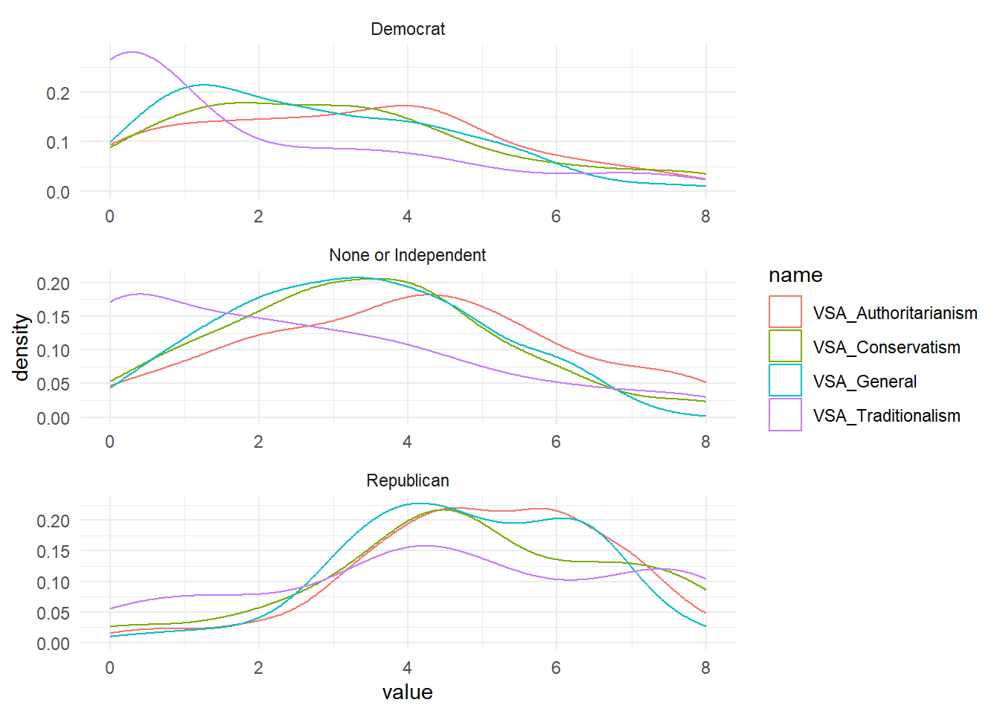
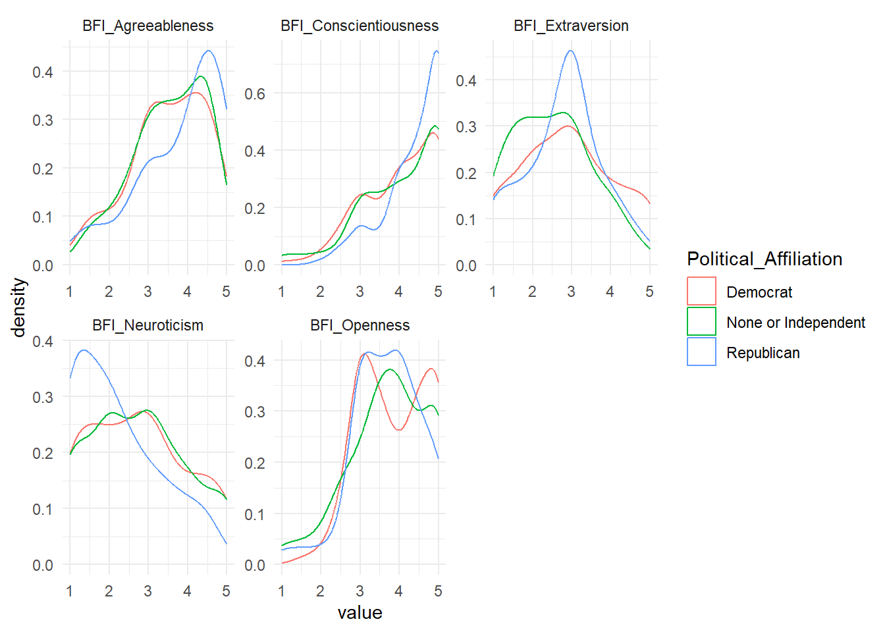
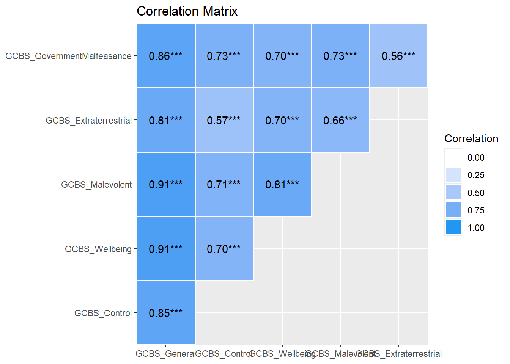
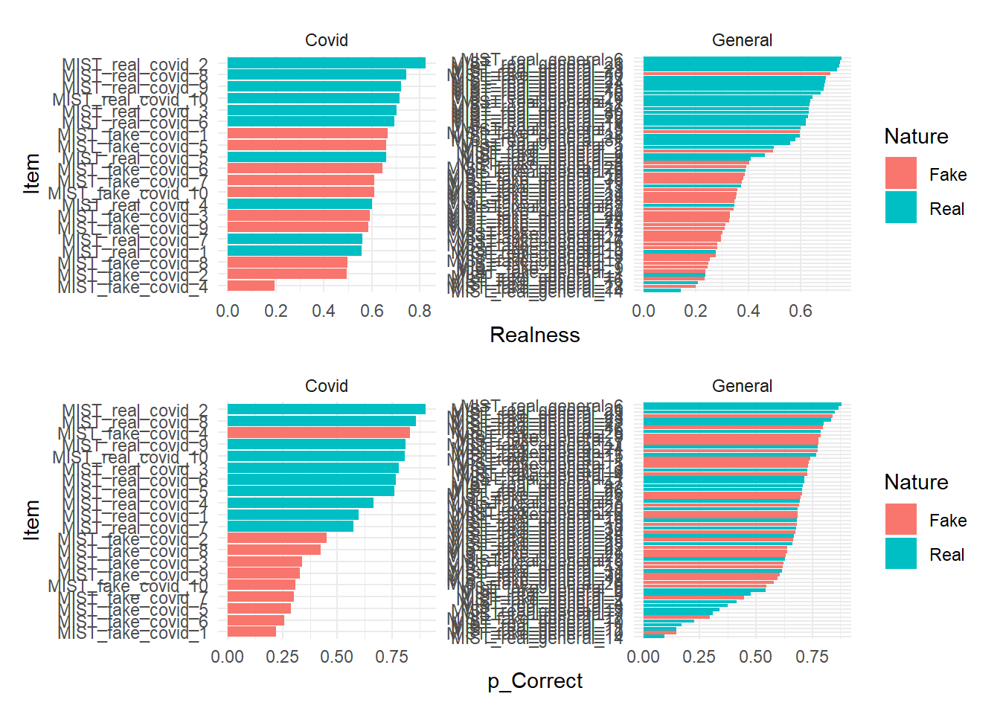
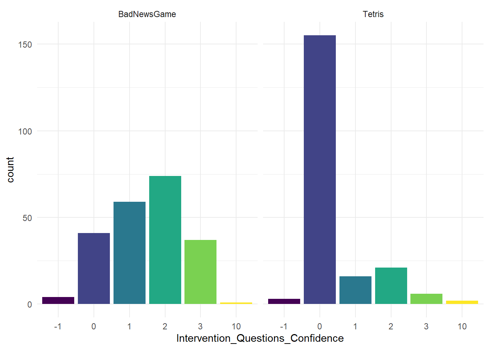
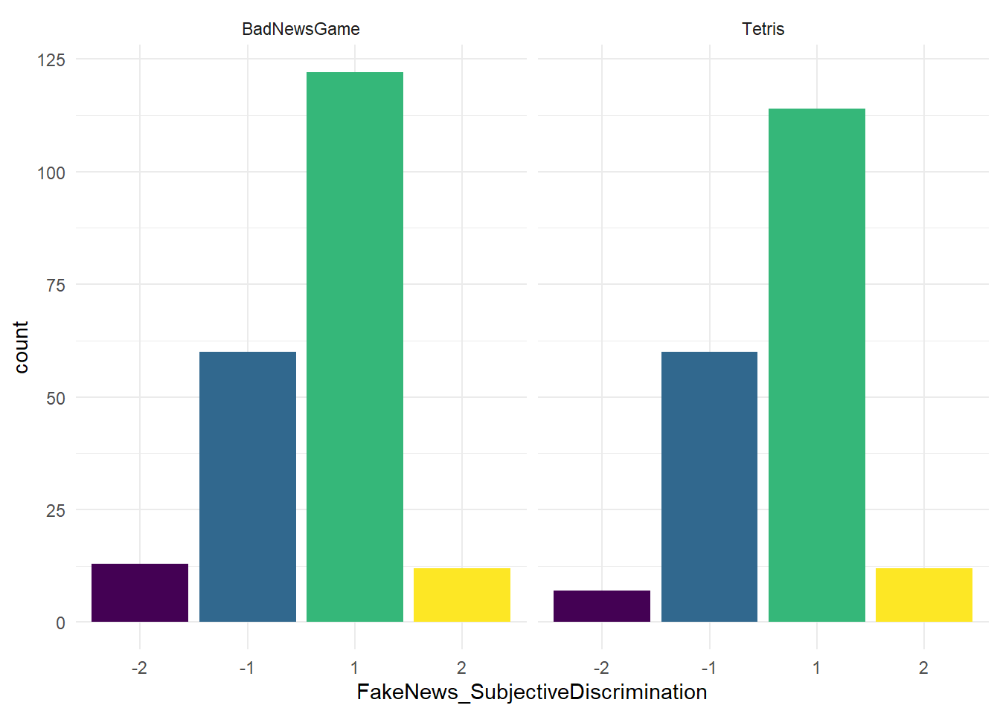
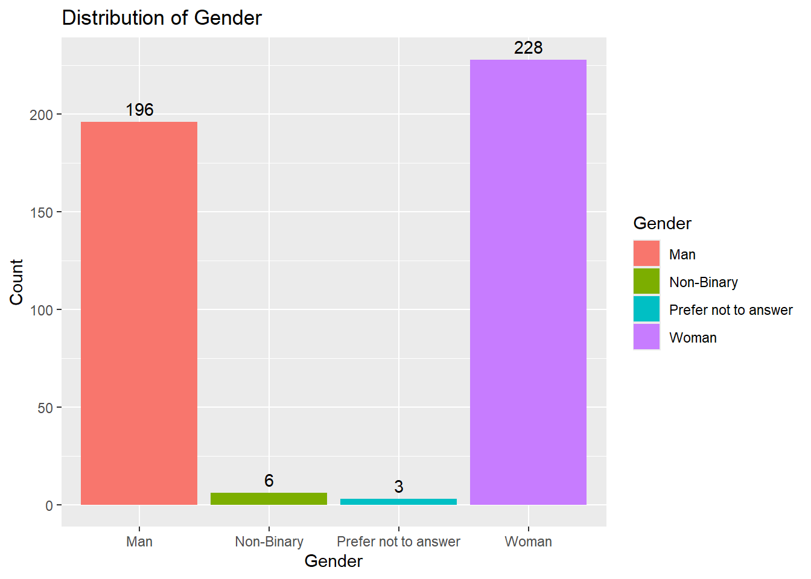

## Data Preparation


::: {.cell}

```{.r .cell-code}
library(tidyverse)
library(easystats)
library(patchwork)
library(ggside)
library(modelsummary)
```
:::

::: {.cell}

```{.r .cell-code  code-fold="false"}
df <- read.csv("../data/rawdata_participants.csv") |> 
  mutate(Political_Affiliation = fct_relevel(Political_Affiliation, "Green", "Labour", "Democrat", "None", "None or Independent", "Liberal-Democrats", "Conservative", "Republican"),
         Political_Ideology = fct_relevel(Political_Ideology, "Extremely Liberal", "Liberal", "Slightly Liberal", "Moderate", "Don't Know", "Slightly Conservative", "Conservative", "Extremely Conservative"))
dfmist <- read.csv("../data/rawdata_mist.csv")

colors_party <- c("Democrat" = "blue", "Republican" = "red", "Labour" = "red", "Conservative" = "blue", "Green" = "green", "None or Independent" = "grey")
```
:::


The initial sample consisted of 421 participants (Mean age = 43.2, SD = 16.4, range: [17, 83], 0.5% missing; Gender: 52.0% women, 45.8% men, 2.14% non-binary; Education: Bachelor, 34.68%; Doctorate, 4.04%; High School, 38.24%; Master, 17.10%; Other, 5.94%)`.


## Exclusion 


::: {.cell}

```{.r .cell-code}
outliers <- list()
```
:::


### Intervention Duration


::: {.cell}

```{.r .cell-code}
df |> 
  ggplot(aes(x=Intervention_Duration, fill=Intervention)) +
  geom_density(alpha=0.6) +
  geom_vline(xintercept = 12, linetype="dashed") +
  theme_minimal()
```

::: {.cell-output-display}
{width=672}
:::

```{.r .cell-code}
t.test(Intervention_Duration ~ Intervention, data=df) |> 
  report::report(data=df)
```

::: {.cell-output .cell-output-stdout}

```
Effect sizes were labelled following Cohen's (1988) recommendations.

The Welch Two Sample t-test testing the difference of Intervention_Duration by
Intervention (mean in group BadNewsGame = 17.01, mean in group Tetris = 13.55)
suggests that the effect is positive, statistically significant, and medium
(difference = 3.47, 95% CI [2.18, 4.75], t(414.09) = 5.31, p < .001; Cohen's d
= 0.52, 95% CI [0.32, 0.71])
```


:::
:::

::: {.cell}

```{.r .cell-code}
outliers$Intervention_Duration <- df$Participant[df$Intervention_Duration < 12]
```
:::


We removed 127 (`insight::format_percent(length(outliers$Intervention_Duration) / nrow(df))`) participants with Intervention Duration < 12 minutes.

### Total Duration


::: {.cell}

```{.r .cell-code}
df |> 
  mutate(Total_Duration = Experiment_Duration - Intervention_Duration) |>
  filter(Experiment_Duration < 120) |>
  ggplot(aes(x=Total_Duration, fill=Intervention)) +
  geom_density(alpha=0.6) +
  geom_vline(xintercept = 10, linetype="dashed") +
  theme_minimal()
```

::: {.cell-output-display}
{width=672}
:::
:::

::: {.cell}

```{.r .cell-code}
outliers$Experiment_Duration <- df$Participant[(df$Experiment_Duration - df$Intervention_Duration) < 10]
outliers$Experiment_Duration <- outliers$Experiment_Duration[!outliers$Experiment_Duration %in% outliers$Intervention_Duration]
```
:::


We additionally removed 7 (`insight::format_percent(length(outliers$Experiment_Duration) / nrow(df))`) participants with Intervention Duration < 20 minutes.


::: {.cell}

```{.r .cell-code}
df <- df[!df$Participant %in% c(outliers$Intervention_Duration, outliers$Experiment_Duration), ]
dfmist <- dfmist[!dfmist$Participant %in% c(outliers$Intervention_Duration, outliers$Experiment_Duration), ]
```
:::


## Questionnaires

### Political Identification


::: {.cell}

```{.r .cell-code}
df |> 
  ggplot(aes(x=Political_Affiliation, fill=Political_Ideology)) +
  geom_bar() +
  theme_minimal() +
  # theme(legend.position = "none") +
  scale_fill_manual(values = c("Extremely Liberal" = "darkred", "Liberal" = "red", "Slightly Liberal" = "pink", "Moderate" = "gold", "Don't Know"="grey", "Slightly Conservative" = "lightblue", "Conservative" = "blue", "Extremely Conservative" = "darkblue")) +
  facet_wrap(~Sample, scales="free")
```

::: {.cell-output-display}
{width=672}
:::

```{.r .cell-code}
df$Political_IdeologyNumeric <- as.numeric(factor(ifelse(df$Political_Ideology == "Don't Know", NA, df$Political_Ideology)))

df |> 
  filter(!is.na(Political_IdeologyNumeric), Sample == "USA") |> 
  ggplot(aes(x=Political_IdeologyNumeric, fill=Political_Affiliation)) +
  geom_histogram() +
  theme_minimal() +
  scale_fill_manual(values = colors_party) 
```

::: {.cell-output .cell-output-stderr}

```
`stat_bin()` using `bins = 30`. Pick better value with `binwidth`.
```


:::

::: {.cell-output-display}
{width=672}
:::
:::


### Authoritarianism (VSA)

Total Right-Wing Authoritarianism score: the sum of all items divided by 6. Note:Item  1 and 2 measure Conservatism or Authoritarian Submission. Items 3 and 4 measure Traditionalism or Conventionalism. Items 5 and 6 measure Authoritarianism or Authoritarian Aggression.


::: {.cell}

```{.r .cell-code}
plot(summary(correlation(select(df, starts_with("VSA_"), -VSA_Duration))))
```

::: {.cell-output-display}
{width=672}
:::

```{.r .cell-code}
df$VSA_Conservatism <- (datawizard::reverse_scale(df$VSA_1, range = c(0, 8)) + df$VSA_2) / 2
df$VSA_Traditionalism <- (df$VSA_3 + datawizard::reverse_scale(df$VSA_4, range = c(0, 8))) / 2
df$VSA_Authoritarianism <- (datawizard::reverse_scale(df$VSA_5, range = c(0, 8)) + df$VSA_6) / 2
df$VSA_General <- rowMeans(df[, c("VSA_Conservatism", "VSA_Traditionalism", "VSA_Authoritarianism")], na.rm = TRUE)

# Remove items that starts with VSA and end with digits
df <- df[!grepl("VSA_*.[0-9]$", names(df))]
df$VSA_Duration <- NULL

p1 <- df |> 
  filter(Sample == "USA") |> 
  pivot_longer(starts_with("VSA_")) |> 
  ggplot(aes(x=value, colour=name)) +
  geom_density() +
  theme_minimal() +
  facet_wrap(~Political_Affiliation, ncol=1, scales="free") 

# TODO: do the same for UK
p1
```

::: {.cell-output-display}
{width=672}
:::
:::


### BFI


::: {.cell}

```{.r .cell-code  code-fold="false"}
df$BFI_Agreeableness <- (df$BFI10_2 + (6-df$BFI10_7)) / 2
df$BFI_Extraversion <- (df$BFI10_6 + (6-df$BFI10_1)) / 2
df$BFI_Conscientiousness <- (df$BFI10_8 + (6-df$BFI10_3)) / 2
df$BFI_Neuroticism <- (df$BFI10_9 + (6-df$BFI10_4)) / 2
df$BFI_Openness <- (df$BFI10_10 + (6-df$BFI10_5)) / 2

# Remove items that starts with BFI and end with digits
df <- df[!grepl("BFI.*[0-9]", names(df))]
df$BFI_Duration <- NULL
```
:::

::: {.cell}

```{.r .cell-code}
p1 <- df |> 
  filter(Sample == "USA") |> 
  pivot_longer(starts_with("BFI_")) |> 
  ggplot(aes(x=value, colour=Political_Affiliation)) +
  geom_density() +
  theme_minimal() +
  facet_wrap(~name, scales="free") 
p1
```

::: {.cell-output-display}
{width=672}
:::
:::


### GCBS


::: {.cell}

```{.r .cell-code}
df$GCBS_GovernmentMalfeasance <- (df$GCBS15_1 + df$GCBS15_6 + df$GCBS15_11) / 3
df$GCBS_Extraterrestrial <- (df$GCBS15_3 + df$GCBS15_8 + df$GCBS15_13) / 3
df$GCBS_Malevolent <- (df$GCBS15_2 + df$GCBS15_7 + df$GCBS15_12) / 3
df$GCBS_Wellbeing <- (df$GCBS15_4 + df$GCBS15_9 + df$GCBS15_14) / 3
df$GCBS_Control <- (df$GCBS15_5 + df$GCBS15_10 + df$GCBS15_15) / 3

# Remove items that starts with BFI and end with digits
df <- df[!grepl("GCBS15.*[0-9]", names(df))]
df$GCBS_Duration <- NULL
df$GCBS_General <- rowMeans(select(df, starts_with("GCBS_")), na.rm = TRUE)

plot(summary(correlation(select(df, starts_with("GCBS_")))))
```

::: {.cell-output-display}
{width=672}
:::

```{.r .cell-code}
p1 <- df |> 
  filter(Sample == "USA") |> 
  pivot_longer(starts_with("GCBS_")) |> 
  ggplot(aes(x=value, colour=Political_Affiliation)) +
  geom_density() +
  theme_minimal() +
  facet_wrap(~name, scales="free") 
p1
```

::: {.cell-output-display}
{width=672}
:::
:::


### MOCRI


::: {.cell}

```{.r .cell-code}
mocri <- df |> 
  select(Participant, starts_with("MOCRI_"), -ends_with("Duration"))  |> 
  pivot_longer(-Participant) |> 
  separate(name, into = c("extra", "Condition", "Item", "Nature"), sep = "_") |> 
  select(-extra) |>
  mutate(
    Correct = ifelse(Nature == "Manipulative" & value == 0, 1, 0),
    True_Positive = ifelse(Nature == "Manipulative" & value == 0, 1, 0),
    True_Negative = ifelse(Nature == "NonManipulative" & value == 1, 1, 0),
    False_Positive = ifelse(Nature == "NonManipulative" & value == 0, 1, 0),
    False_Negative = ifelse(Nature == "Manipulative" & value == 1, 1, 0),
    Manipulative = ifelse(value == 0, 1, 0),
    Item = paste0(Condition, "_", Item),
    Condition = ifelse(Condition == "POST", "Post-test", "Pre-test")
    ) |> 
  select(-value)

mocri |> 
  summarise(N = sum(Manipulative), .by = c("Participant", "Nature", "Condition")) |> 
  ggplot(aes(x=Nature, y=N)) +
  geom_bar(stat="identity") +
  facet_grid(~Condition) 
```

::: {.cell-output-display}
{width=672}
:::

```{.r .cell-code}
df <- mocri |> 
  summarise(
    MOCRI_Correct = sum(Correct) / n(),
    MOCRI_N_Manipulative = sum(True_Positive) + sum(False_Positive),
    MOCRI_N_NonManipulative = sum(True_Negative) + sum(False_Negative),
    MOCRI_True_Positive = sum(True_Positive),
    MOCRI_True_Negative = sum(True_Negative),
    MOCRI_False_Positive = sum(False_Positive),
    MOCRI_False_Negative = sum(False_Negative),
    .by = c("Participant", "Condition")
  ) |> 
  pivot_wider(names_from = Condition, values_from = -c(Participant, Condition)) |> 
  full_join(df, by = "Participant")

# Remove cols that start with MOCRI and contain a digit
df <- df[!grepl("^MOCRI.*[0-9].*", names(df))]
```
:::

::: {.cell}

```{.r .cell-code}
# compute_dprime <- function(data) {
#   # Calculate hit rate and false alarm rate
#   H <- (data$True_Positive + 0.5) / (data$True_Positive + data$False_Negative + 1)  # Adjusted Hit Rate
#   FA <- (data$False_Positive + 0.5) / (data$False_Positive + data$True_Negative + 1) # Adjusted False Alarm Rate
#   
#   # Parametric ----
#   # Compute z-scores
#   zH <- qnorm(H) # z-score for hit rate
#   zFA <- qnorm(FA) # z-score for false alarm rate
#   
#   # d' and criterion
#   d_prime <- zH - zFA
#   criterion <- -0.5 * (zH + zFA)
#   
#   # Non-parametric ----
#   # A' (A-prime)
#   A_prime <- ifelse(
#     H > FA,
#     0.5 + ((H - FA) * (1 + H - FA)) / (4 * H * (1 - FA)),
#     ifelse(
#       H < FA,
#       0.5 + ((FA - H) * (1 + FA - H)) / (4 * FA * (1 - H)),
#       0.5
#     )
#   )
#   
#   # B''d
#   B_double_prime <- ifelse(
#     H != FA,
#     ((1 - H) * (1 - FA) - H * FA) / ((1 - H) * (1 - FA) + H * FA),
#     0
#   )
#   
#   # Combine results
#   cbind(data, data.frame(
#     "dprime" = d_prime,
#     "criterion" = criterion,
#     "aprime" = A_prime,
#     "bppd" = B_double_prime
#   ))
# }


# # Participant scores
# df <- mocri |> 
#   summarise(
#     correct = sum(Correct) / n(),
#     True_Positive = sum(True_Positive),
#     True_Negative = sum(True_Negative),
#     False_Positive = sum(False_Positive),
#     False_Negative = sum(False_Negative),
#     .by = c("Participant", "Type")
#   ) |> 
#   compute_dprime() |>  
#   select(Participant, Type, correct, dprime, criterion, aprime, bppd) |>
#   pivot_wider(names_from=c("Type"), 
#               values_from=c("correct", "dprime", "criterion", "aprime", "bppd"),
#               names_vary = "fastest") |> 
#   mutate(correct_Diff = correct_Post - correct_Pre,
#          dprime_Diff = dprime_Post - dprime_Pre,
#          criterion_Diff = criterion_Post - criterion_Pre,
#          bppd_Diff = bppd_Post - bppd_Pre) |>
#   datawizard::data_addprefix("MOCRI_", select=-Participant) |>  
#   full_join(df, by="Participant")
# 
# 
# df |> 
#   summarise(
#     dprime_Pre_avg = mean(MOCRI_dprime_Pre, na.rm = TRUE), 
#     dprime_Pre_min = min(MOCRI_dprime_Pre, na.rm = TRUE), 
#     dprime_Pre_max = max(MOCRI_dprime_Pre, na.rm = TRUE),
#     dprime_Post_avg = mean(MOCRI_dprime_Post, na.rm = TRUE), 
#     dprime_Post_min = min(MOCRI_dprime_Post, na.rm = TRUE), 
#     dprime_Post_max = max(MOCRI_dprime_Post, na.rm = TRUE)
#   )
# 
# 
# df |> 
#   ggplot(aes(x = MOCRI_correct_Pre, y = MOCRI_dprime_Pre, color = "Pre")) + 
#   geom_point() + 
#   geom_smooth(method = "lm", se = FALSE) +
#   geom_point(aes(x = MOCRI_correct_Post, y = MOCRI_dprime_Post, color = "Post")) +
#   geom_smooth(aes(x = MOCRI_correct_Post, y = MOCRI_dprime_Post, color = "Post"), method = "lm", se = FALSE) +
#   labs(title = "MOCRI Correct vs. dprime", x = "Correct", y = "dprime")
```
:::


### MIST


::: {.cell}

```{.r .cell-code}
dfmist <- dfmist |>
  full_join(df[, c("Participant", "Intervention")], by = "Participant") |>
  mutate(
    Correct = case_when(
      Realness > 0.5 & Nature == "Real" ~ 1,
      Realness < 0.5 & Nature == "Fake" ~ 1,
      .default = 0
    ),
    True_Positive = ifelse(Realness < 0.5 & Nature == "Fake", 1, 0),
    True_Negative = ifelse(Realness > 0.5 & Nature == "Real", 1, 0),
    False_Positive = ifelse(Realness < 0.5 & Nature == "Real", 1, 0),
    False_Negative = ifelse(Realness > 0.5 & Nature == "Fake", 1, 0)
    ) 
```
:::


#### Items


::: {.cell}

```{.r .cell-code}
p1 <- dfmist |> 
  summarise(Realness = mean(Realness),
            Nature = unique(Nature),
            Topic = unique(Topic),
            .by=c("Item")) |> 
  mutate(Item = fct_reorder(Item, Realness)) |> 
  ggplot(aes(x=Realness, y=Item, fill=Nature)) +
  geom_bar(stat="identity") +
  facet_wrap(~Topic, scales="free") +
  theme_minimal()

p2 <- dfmist |> 
  summarise(p_Correct = sum(Correct) / n(), 
            Nature = unique(Nature),
            Topic = unique(Topic),
            .by=c("Item")) |> 
  mutate(Item = fct_reorder(Item, p_Correct)) |> 
  ggplot(aes(x=p_Correct, y=Item, fill=Nature)) +
  geom_bar(stat="identity") +
  facet_wrap(~Topic, scales="free") +
  theme_minimal()

p1 / p2
```

::: {.cell-output-display}
{width=672}
:::
:::


#### Scores


::: {.cell}

```{.r .cell-code}
df <- dfmist |> 
  summarise(
    MIST_Correct = sum(Correct) / n(),
    MIST_N_Fake = sum(True_Positive) + sum(False_Positive),
    MIST_N_Real = sum(True_Negative) + sum(False_Negative),
    MIST_True_Positive = sum(True_Positive),
    MIST_True_Negative = sum(True_Negative),
    MIST_False_Positive = sum(False_Positive),
    MIST_False_Negative = sum(False_Negative),
    .by = c("Participant", "Condition")
  ) |> 
  pivot_wider(names_from = Condition, values_from = -c(Participant, Condition)) |> 
  full_join(df, by = "Participant")

df <- df[!grepl("MIST_.*[0-9].*", names(df))]

# Participant scores
# df <- dfmist |> 
#   summarise(
#     correct = sum(Correct) / n(),
#     True_Positive = sum(True_Positive),
#     True_Negative = sum(True_Negative),
#     False_Positive = sum(False_Positive),
#     False_Negative = sum(False_Negative),
#     .by = c("Participant", "Condition", "Topic")
#   ) |> 
#   compute_dprime() |>  
#   select(Participant, Condition, Topic, correct, dprime, criterion, aprime, bppd) |>
#   pivot_wider(names_from=c("Condition", "Topic"), 
#               values_from=c("correct", "dprime", "criterion", "aprime", "bppd"),
#               names_vary = "slowest") |> 
#   mutate(correct_Diff_covid = correct_Posttest_covid - correct_Pretest_covid,
#          correct_Diff_general = correct_Posttest_general - correct_Pretest_general,
#          dprime_Diff_covid =  dprime_Posttest_covid - dprime_Pretest_covid,
#          dprime_Diff_general = dprime_Posttest_general - dprime_Pretest_general,
#          criterion_Diff_covid = criterion_Posttest_covid - criterion_Pretest_covid,
#          criterion_Diff_general = criterion_Posttest_general - criterion_Pretest_general,
#          aprime_Diff_covid = aprime_Posttest_covid - aprime_Pretest_covid,
#          aprime_Diff_general = aprime_Posttest_general - aprime_Pretest_general,
#          bppd_Diff_covid = bppd_Posttest_covid - bppd_Pretest_covid,
#          bppd_Diff_general = bppd_Posttest_general - bppd_Pretest_general) |>
#   datawizard::data_addprefix("MIST_", select=-Participant) |>  
#   full_join(df, by="Participant")
# 
# df$MIST_correct_Diff <- (df$MIST_correct_Diff_covid + df$MIST_correct_Diff_general) / 2
# df$MIST_dprime_Diff <- (df$MIST_dprime_Diff_covid + df$MIST_dprime_Diff_general) / 2
```
:::


### Self-Assessments


::: {.cell}

```{.r .cell-code}
df <- df |> 
  mutate(Intervention_Questions_Confidence = case_when(
    Intervention_Questions_Confidence == "Unsure/refuse to answer" ~ NA,
    Intervention_Questions_Confidence == "Slightly declined" ~ -1,
    Intervention_Questions_Confidence == "No impact" ~ 0,
    Intervention_Questions_Confidence == "Slightly improved" ~ 1,
    Intervention_Questions_Confidence == "Improved" ~ 2,
    Intervention_Questions_Confidence == "Greatly improved" ~ 3,
    .default = 10
  ))

table(df$Intervention_Questions_Confidence) / nrow(df) 
```

::: {.cell-output .cell-output-stdout}

```

        -1          0          1          2          3 
0.02090592 0.44250871 0.17770035 0.23344948 0.09756098 
```


:::

```{.r .cell-code}
df |> 
  filter(!is.na(Intervention_Questions_Confidence)) |> 
  mutate(Intervention_Questions_Confidence = as.factor(Intervention_Questions_Confidence)) |> 
  ggplot(aes(x = Intervention_Questions_Confidence, fill = Intervention_Questions_Confidence)) +
  geom_bar() +
  scale_fill_viridis_d(guide = "none") +
  theme_minimal()
```

::: {.cell-output-display}
{width=672}
:::

```{.r .cell-code}
df$Intervention_SubjectiveEffect <- ifelse(df$Intervention_Questions_Confidence > 0, 1, 0)
```
:::


## Final Sample 

### Gender


::: {.cell}

```{.r .cell-code}
ggplot(df, aes(x = Gender, fill = Gender)) +
    geom_bar() +
    labs(title = "Distribution of Gender", x = "Gender", y = "Count")
```

::: {.cell-output-display}
{width=672}
:::
:::


### Education


::: {.cell}

```{.r .cell-code}
# Create the bar chart for Education
ggplot(df, aes(x = Education, fill = Education)) +
  geom_bar() +
  labs(title = "Distribution of Education Level",
       x = "Education Level",
       y = "Count") +
  theme_minimal()  # Optional: Adds a minimal theme for better aesthetics
```

::: {.cell-output-display}
{width=672}
:::
:::


### COVID Vaccination


::: {.cell}

```{.r .cell-code}
ggplot(df, aes(x = COVID_Vaccination, fill = Education)) +
  geom_bar() +
  labs(x = "COVID Vaccination Status", y = "Count") +
  theme_minimal()
```

::: {.cell-output-display}
{width=672}
:::

```{.r .cell-code}
df$COVID_Vaccination <- ifelse(!df$COVID_Vaccination %in% c("Yes", "No"), NA, df$COVID_Vaccination) 
```
:::


## Save


::: {.cell}

```{.r .cell-code}
write.csv(df, "../data/data_participants.csv", row.names = FALSE)
write.csv(dfmist, "../data/data_mist.csv", row.names = FALSE)
write.csv(mocri, "../data/data_mocri.csv", row.names = FALSE)
```
:::

